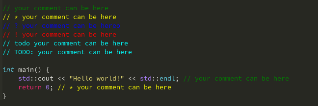

# Better Comments

Расширение Better Comments поможет создавать в коде более понятные комментарии.

* `*` - важная информация.
* `?` - вопрос.
* `!` - важное предупреждение.
* `TODO` - требуется доделать/реализовать.

# Возможная конфигурация Vim.

## Включение по команде

Включение BetterComments по команде `\bc`.

    nnoremap <buffer> <localleader>bc :call bettercomments#Enable()<cr>

## Автоматическое включение

Автоматический запуск во всех файлах.

    autocmd BufReadPost * call bettercomments#Enable()

Автоматический запуск только в определённых файлах.

    autocmd BufReadPost *.py call bettercomments#Enable()

## Изменение цвета

Дефолтные цвета.

    let g:other_color_guifg = 'green'
    let g:information_color_guifg = 'yellow'
    let g:question_color_guifg = 'blue'
    let g:attention_color_guifg = 'red'
    let g:todo_color_guifg = 'cyan'

Изменение цвета.

Изменение цвета на стандартный цвет в vim.

    let g:other_color_guifg = 'magenta'

Изменение цвета на hex цвет.

    let g:other_color_guifg = '#6632a8'

Доступные стандартные цвета.

* Black
* DarkBlue
* DarkGreen
* DarkCyan
* DarkRed
* DarkMagenta
* Brown, DarkYellow
* LightGray, LightGrey, Gray, Grey
* DarkGray, DarkGrey
* Blue, LightBlue
* Green, LightGreen
* Cyan, LightCyan
* Red, LightRed
* Magenta, LightMagenta
* Yellow, LightYellow
* White

## Добавление нового формата

Если нужный язык отсутствует в стандартной конфигурации,
можно добавить его самостоятельно.

    let g:delimiter_filetype_custom = {
        \ '<filetype>'        :   {'left' : '<comment_symbol>'},
        \ '<filetype>'        :   {'left' : '<comment_symbol>', 'right' : '<closing_comment_symbol>'},
        \ }

Для того чтобы узнать какой тип файла у языка, откройте нужный файл и нажмите `:echo &filetype`.

## Отключение части подсветок

Для отключения некоторых подсветок.

Стандартная модификация.

    let g:other_color_enable = 1
    let g:information_color_enable = 1
    let g:question_color_enable = 1
    let g:attention_color_enable = 1
    let g:todo_color_enable = 1

Если нужно отключить какую-то подсветку.

    let g:todo_color_enable = 0
